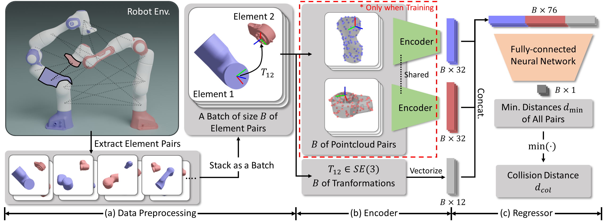

# PairwiseNet: Pairwise Collision Distance Learning for High-dof Robot Systems
The official repository for \<A PairwiseNet: Pairwise Collision Distance Learning for High-dof Robot Systems\> (Jihwan Kim* and Frank C. Park, CoRL 2023).

> PairwiseNet is a novel method that estimates the pairwise collision distance between pairs of elements in a robot system, providing an alternative approach to data-driven methods that estimate the global collision distance.

- *[Paper](https://proceedings.mlr.press/v229/kim23d.html)* 
- *[Poster](https://drive.google.com/file/d/1OPQfOK1nq3hHV7oppfz5Sn-puHJUtl1q/view?usp=drive_link)*  
- *[3-min Slide Video](https://youtu.be/YuotzrBn1ks?si=QavzqhQqoaMiPFJe)*  

## Preview

### Pairwise Collision Distance Learning

<center>
<div class="imgCollage">
</span>
</div>
</center>

### Collision Distance Estimation for Multi-arm Robot Systems

<center>
<div class="imgCollage">
</span>
</div>
</center>

## Requirements

### Environment

We recommend using Anaconda for environment management. Set up the Python environment with the following commands:
```bash
conda env create -f environment.yml
conda activate PairwiseNet
```
Make any necessary adjustments based on your specific setup.

### Datasets

Generate the pairwise collision distance dataset for the multi-arm robot system using:
```bash
python generate_dataset_multiarm_pairwise.py \
  --config configs/pairwise_dataset_generation/data_config_multiarm.yml
```
Adjust the generation settings in `data_config_multiarm.yml` as required.

Also, generate the global collision distance dataset (used for testing) with:
```bash
python generate_dataset_multiarm_global.py \
  --env configs/env/{env_config} \
  --n_data {N}
```
- `env_config` is the configuration file (e.g., .yml) for the target robot system, such as `env_config_multipanda.yml`.
- `N` denotes the number of data points (joint configurations) in the dataset.

## Training

Start the PairwiseNet training procedure with:
```bash
python train.py \
  --config configs/training/{training_config} \
  --device {device} \
  --run {run_id}
```
- `training_config` is the training configuration file, like `config_PairwiseNet.yml`. 
- `device` indicates the GPU device index, either `0` or `1`, or use `cpu` for CPU processing.
- `run_id` is a user-defined string identifier for the training session.

## Citation
If you find this repository helpful for your research, consider citing:
```
@inproceedings{kim2023pairwisenet,
  title={PairwiseNet: Pairwise Collision Distance Learning for High-dof Robot Systems},
  author={Kim, Jihwan and Park, Frank C},
  booktitle={7th Annual Conference on Robot Learning},
  year={2023}
}
```